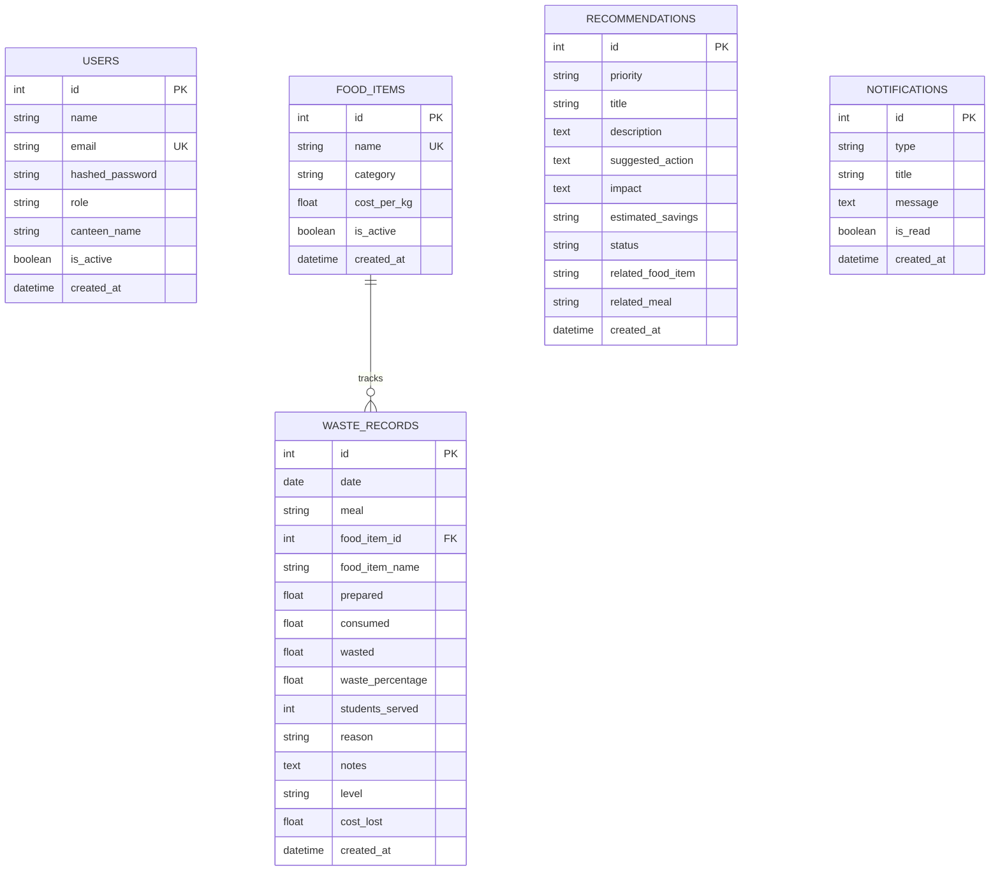

# WasteWise — Technical Report & Architecture Documentation

## Executive Summary
**WasteWise** is a full-stack web platform designed for canteen administrators to track, analyze, and minimize institutional food waste. The platform provides real-time waste logging, automated rule-based recommendations, analytics dashboards, CSV bulk data import, and PDF report export.

---

## System Architecture

```mermaid
graph TD
    Client["React 19 + Vite Frontend (Port 5173)"]
    API["FastAPI REST Server (Port 8000)"]
    DB[(SQLite Database - wastewise.db)]
    Engine["Rule-Based Recommendation Engine"]

    Client -->|HTTP / JSON (JWT Auth)| API
    API -->|SQLAlchemy ORM| DB
    Engine -->|Analytical Rules| DB
    API -->|Executes| Engine
```

---

## 1. Frontend Specifications

### Tech Stack & Dependencies
- **Core Framework**: React 19 with TypeScript 5.x
- **Build Tool**: Vite 8 ESM Bundler
- **Styling Architecture**: Custom CSS Design System with CSS variables (`globals.css`, `layout.css`, `login.css`)
- **Iconography**: Lucide React
- **Data Visualization**: Recharts (Area, Bar, Pie charts)
- **Document Export**: jsPDF (Branded client-side PDF generation)
- **Data Import**: PapaParse (CSV Parsing & Validation)
- **Date Handling**: date-fns

### Design System & Theme Engine
- **Colors**: Vibrant eco-greens (`#16a34a`, `#22c55e`), teals (`#0d9488`), semantic warning/danger accents, HSL color tokens.
- **Theme Modes**: Full Light & Dark mode support via `[data-theme="dark"]`.
- **Micro-Interactions**: Shimmer loading skeletons, page slide-in transitions, animated progress indicators.

### Component Structure & Key Modules
1. **`AppContext.tsx`**: Central state hub utilizing `useReducer` for reactive state distribution across components and REST API synchronization.
2. **`Dashboard.tsx`**: KPI cards (Prepared, Consumed, Wasted, Waste Rate, Cost Lost, Reduction %), interactive trend charts, monthly goals progress widget, dynamic insights, and quick action shortcuts.
3. **`WasteRecording.tsx`**: Single-item waste entry form with automatic waste % computation and severity classification (`Low`, `Moderate`, `High`, `Critical`).
4. **`WasteRecords.tsx`**: Interactive tabular view featuring search, filter by meal/level/date range, sorting, pagination, and quick-import launcher.
5. **`BulkImport.tsx`**: Drag-and-drop CSV importer with schema validation, error highlighting, data preview table, and batch submission.
6. **`Analytics.tsx`**: Deep analytical views (day-of-week waste rates, food category distribution, root-cause reason breakdown, top wasted items).
7. **`Recommendations.tsx`**: Interactive recommendation cards with status actions (`Apply`, `Dismiss`).
8. **`Reports.tsx`**: Customizable date/meal range report builder with instantaneous PDF report generation and CSV dataset export.
9. **`FoodItems.tsx`**: Food catalog management with per-kg cost tracking.
10. **`Settings.tsx`**: Profile configuration, waste reduction targets configuration, push/email notification preferences, and theme toggle.

---

## 2. Backend Specifications

### Tech Stack
- **Framework**: FastAPI (Python 3.10+)
- **ASGI Server**: Uvicorn
- **ORM**: SQLAlchemy
- **Schema Validation**: Pydantic v2
- **Authentication**: JWT Bearer Tokens (OAuth2 Password Flow) with Passlib (Bcrypt hashing)

### REST API Route Registry

| Prefix | Endpoint | Method | Description |
|---|---|---|---|
| `/api/auth` | `/login` | `POST` | Authenticate user and issue JWT token |
| `/api/auth` | `/me` | `GET` | Fetch authenticated user profile |
| `/api/records` | `/` | `GET` | Paginated waste records list with search & date filters |
| `/api/records` | `/` | `POST` | Create a new waste record (recomputes waste % & cost lost) |
| `/api/records` | `/{id}` | `PUT` | Update waste record |
| `/api/records` | `/{id}` | `DELETE` | Delete waste record |
| `/api/food-items` | `/` | `GET` | Fetch all food items catalog |
| `/api/food-items` | `/` | `POST` | Create a new food catalog item |
| `/api/analytics` | `/dashboard` | `GET` | Compute period-over-period KPI metrics |
| `/api/analytics` | `/trend` | `GET` | Time-series trend data points |
| `/api/analytics` | `/category-breakdown` | `GET` | Aggregated waste by food category |
| `/api/analytics` | `/meal-wise` | `GET` | Prepared vs Consumed vs Wasted by meal |
| `/api/recommendations` | `/` | `GET` | Fetch all recommendations |
| `/api/recommendations` | `/{id}/status` | `PUT` | Update recommendation status (`Active`, `Applied`, `Dismissed`) |

### Rule-Based Recommendation Engine (`services/recommendation_engine.py`)
The engine evaluates historic waste records against predefined heuristics:
1. **High Waste Item Detection**: Flags items exceeding 20% waste threshold across 3+ entries.
2. **Meal Overproduction Rule**: Identifies specific meal times (e.g. Friday lunch) with consistent surplus.
3. **Reason Analysis Rule**: Generates actionable advisories when "Spoilage" or "Poor quality" is logged.
4. **Savings Calculator**: Estimates monthly monetary savings achievable by optimizing prep quantities.

---

## 3. Database Schema Specification

The application uses **SQLite** (`wastewise.db`) managed via SQLAlchemy ORM.

### Entity Relationship Diagram



---

## 4. Environment & Deployment Configuration

### Prerequisites
- Node.js 18+ and npm
- Python 3.10+ and pip

### Running Locally

1. **Start Backend Server**:
   ```bash
   cd backend
   pip install -r requirements.txt
   python seed.py         # Seed database with initial data & credentials
   uvicorn main:app --reload --port 8000
   ```

2. **Start Frontend Dev Server**:
   ```bash
   npm install
   npm run dev
   ```

3. **Access App**:
   - Web App: `http://localhost:5173`
   - API Docs: `http://localhost:8000/docs`
